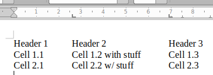
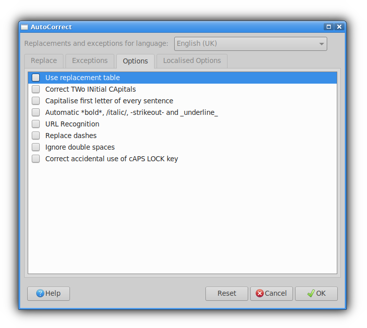
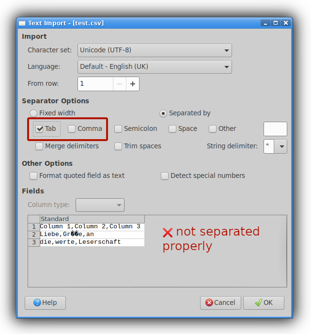
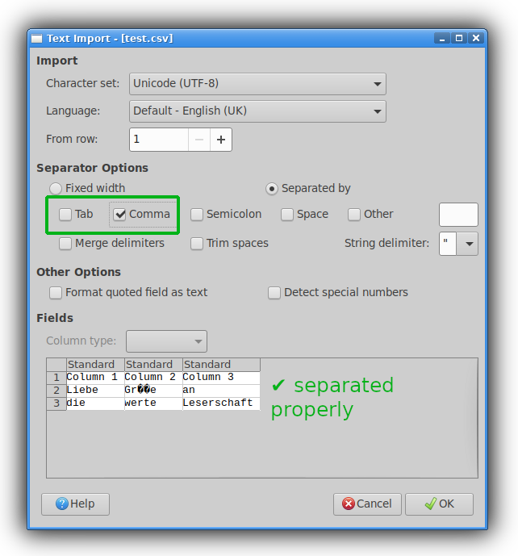
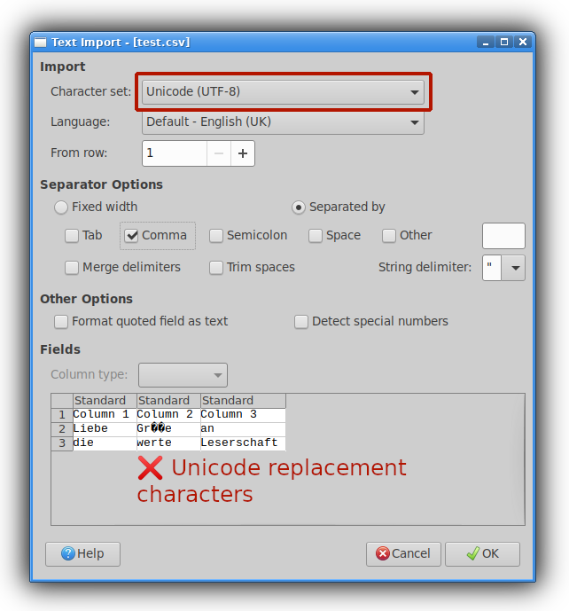
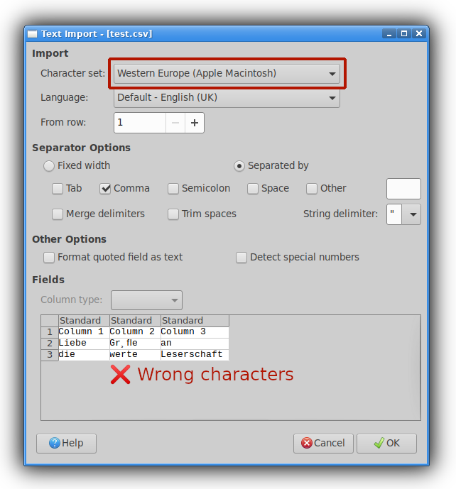
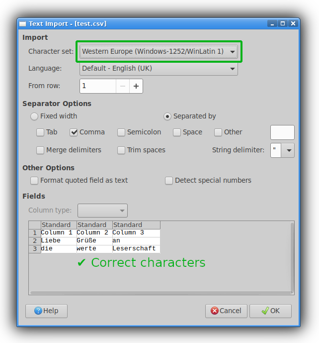
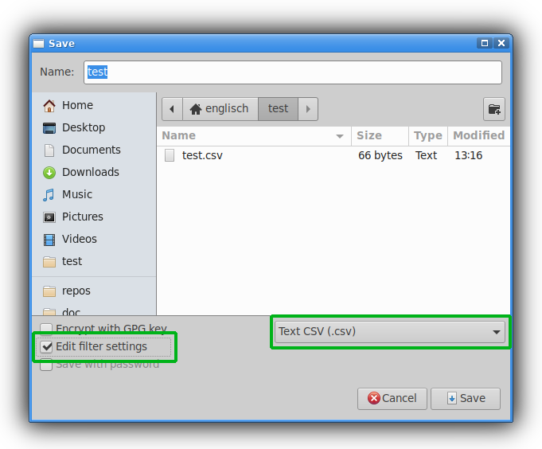
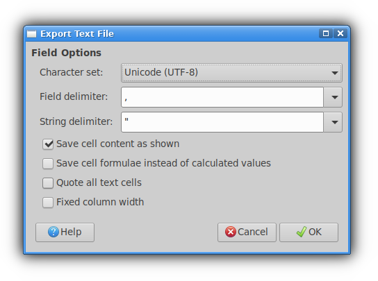

CSV and TSV:  Tabular data in plain text
========================================

Introduction
------------

CSV and TSV are text-based data formats used to store and transfer tables.  We
like these formats because:

 * They're common and well-understood.
 * They're easy to understand for human beings.
 * They're easy to parse with computer programs.
 * Your favourite spreadsheet program can import and export them 
   \*cough\*excelisnotyourfavouritespreadsheetprogram\*cough\*
 * Your favourite programming language has a library that can read and write
   them.
 * They lend themselves (somewhat) well to [revision control systems like git](./git.md).

*Prerequisites:*
Since CSV and TSV are plain-text formats it might be a good idea to first read
and understand the tutorial on
[how plain-text and character encodings work](./text-and-encodings.md).

How CSV files work
------------------

CSV stands for _**C**omma-**S**eparated **V**alues_, which describes the format
pretty well.  A CSV file is a text file that contains exactly one table.  Each
line in that text file is a row in the table.  The cells of each row are
separated using commas.  The result looks like this:

    Header 1,Header 2,Header 3
    Cell 1.1,Cell 1.2,Cell 1.3
    Cell 2.1,Cell 2.2,Cell 2.3

Also, it is possible to put double quotes `"` around cells.  When cells are
quoted they can also contain commas and line breaks themselves, which is quite
useful.  Also, if you want to put quotes inside of your quoted cells, you can do
so by putting in two quotation marks in a row.  Some examples:

    Header 1,Header 2,Header 3
    Cell 1.1,"Cell 1.2 (quoted just for the heck of it)",Cell 1.3
    Cell 2.1,"Cell 2.2 (quoted, with a comma)",Cell 2.3
    Cell 3.1,"Cell 3.2 (with a
    newline)",Cell 3.3
    Cell 4.1,"Cell 4.2 (containing ""quotes"")",Cell 4.3

And that's all there's to it.

How TSV files work
------------------

TSV files are a very similar file format to CSV.  TSV stands for
_**T**ab-**S**eparated **V**alues_.  As the name suggests, this format uses *tab
characters* to separate the cells within each line:

    Header 1<tab>Header 2<tab>Header 3
    Cell 1.1<tab>Cell 1.2<tab>Cell 1.3
    Cell 2.1<tab>Cell 2.2<tab>Cell 2.3

Now, what is a tab character?  A *tab* (code point `9` in both ASCII and
Unicode) is a white space character that represents the tabulator key on your
keyboard.  It moves the following text to the right so it aligns with some kind
of imaginary vertical line.  Where that line is?  Well that is entirely up to
the program that displays the text…  So, as an example, look at the following
TSV table, where I replaced the `<tab>` place holder with actual tab characters:

    Header 1	Header 2	Header 3
    Cell 1.1	Cell 1.2 with stuff	Cell 1.3
    Cell 2.1	Cell 2.2 w/ stuff	Cell 2.3

I literally cannot tell you what you are seeing right now:

 * If you look at the rendered version on GitHub, their webpage will just put
   the imaginary tab lines wherever it wants.
 * If you look at the Markdown version of this file in a text editor, you can
   configure the tab width in its config file/settings menu.  Many text editors
   default to a tab every 4 or 8 characters.
 * If you copy-paste the text into a Word Processor like LibreOffice, you can
   use the ruler at the top to put the tabs wherever you want them to be… 
   

But I do have some guesses of what you might see:

 * There is a good chance all the cells in column 2 line up with each other
   rather nicely.
 * There is a good chance the cells in column 3 don't all line up – because some
   of the cells go over the ‘imaginary line’ and push everything back.
 * There is a chance that `Cell 1.3` and `Cell 2.3` *do* line up with each
   other.

It's actually not very common to find tabs inside of regular text (outside of
program code) – instead they're usually used to separate bits of text from each
other, which is precisely what TSV files do.  And because tabs aren't actually
supposed to be used in text, the TSV standard (technically) does not allow
quoting and instead requires tabs and newline to be replaced with escape
sequences like `\t` or `\n`.

Differences between CSV and TSV
-------------------------------

### In theory

While the TSV and CSV formats are very very similar, they are actually separate
formats defined in separate standards:

 * CSV: [RFC 4180][csv-std]
 * TSV: [IANA MIME type][tsv-std]

[csv-std]: https://datatracker.ietf.org/doc/html/rfc4180
[tsv-std]: https://www.iana.org/assignments/media-types/text/tab-separated-values

Aside from the choice of separator there are a few details that are different
between the standards:

 * CSV allows quoting, TSV doesn't.
 * TSV requires the first row to contain the names for all columns, CSV doesn't.
 * CSV requires CRLF line endings to be used, the TSV standard does not mention
   any line ending scheme explicitly.
 * The TSV standard explicitly mentions that all rows must have the same number
   of cells.

### In practice

All bets are off…

Basically, the two standards are just summaries of practices that a disjointed
cloud of people across the internet had already been using.  And out in the
field people parse and generate all sorts of data.  Some implementations choke
if there are rows of different sizes, others just deal with it.  Some
implementations don't allow quoting, some do.  Some allow CSV files with
semicolons instead of commas.  I even vaguely remember programs that generate
comma-separated values when they're set to English and semicolon-separated
values if they're set to a language like German, which uses commas in place of
decimal points (e.g. 3,141592653589793).

Also, a lot of implementations also don't treat the two standards as separate
and just treat TSV as ‘CSV with tabs instead of commas’.  Others might make
a difference, though – who knows…

Best practices for working with CSV/TSV files
---------------------------------------------

### When editing spreadsheets in general

 * It's generally a good idea use the first row of the table for column names
   – any workflow that relies on human beings to remember or guess what the data
   was supposed to be is doomed to fall apart eventually…

 * Avoid typographic quotes (`‘’`, `“”`, `„“`, etc.) in your table.  While they
   pose no problem for the computer (they're separate Unicode code points after
   all), they make life more confusing for human beings, whenever they have to
   look at the raw data.

 * Keep backups of all files before making significant changes 
   (bonus points for using revision control).

 * Double- and triple-check that the character encoding isn't broken when
   importing or exporting CSV/TSV.

### When generating CSV/TSV files

If you're writing code that generates tabular data (no matter whether it's in
Python, or R, or whatever) it is a good idea to follow these guidelines:

 * Stick to the standards as closely as you can.

 * Make sure all rows have the same width.

 * Don't generate empty rows or empty columns.

### When reading CSV/TSV files

If you're writing code that reads tabular data there are also guidelines you
should keep in mind:

 * Don't assume anyone adheres to any standards…

 * Make sure your program can handle trailing or missing cells…

 * Don't assume empty rows or empty columns mark the end of a spreadsheet…

A quick note on Microsoft Excel
-------------------------------

I hear it is possible to work with CSV data in Excel but I haven't met anyone
who's actually managed to do it…  People seem to struggle with the UI a lot.
Importing CSV seems to be somewhat reliable once you figured out how to do it,
but exporting seems to be a problem.  Sometimes the format isn't right,
sometimes the character encoding isn't right.

Currently most people just walk the path of least resistance and switch to
LibreOffice Calc instead.  It can be a bit janky at times, but at least it
works.

(Side note:  I never tried the Numbers program by Apple, nor any of those
browser-based programs like OnlyOffice or Google Docs.  So I don't know how well
those work.)

Working with CSV and TSV files in LibreOffice Calc
--------------------------------------------------

### Recommendation: Turn off auto-correction features

By default LibreOffice enables a lot of features that automatically correct
common user mistakes – stuff like replacing quotations marks and hyphens with
typographically more pleasing alternatives (`“”`, `–`), switching letters from
lower-case to upper-case or back, and so forth.

While these features were made with the best of intentions, they can get in the
way when working with research data, where stuff like capitalisation is
important.  Because of that it's recommended to open the auto-correction options
under `Tools → AutoCorrect Options…` and turn off all the things.

### Importing TSV/CSV data into LibreOffice Calc

The easiest way to import a TSV/CSV file is to just open the file in LibreOffice
Calc (either from your file manager or by using *File → Open* in the menu bar.
This will open the import dialogue where you can tell LibreOffice about the
format of the file.  It also comes with a small preview where you can
double-check the effects of your settings.  There are two things to look out
for: the *separator* and the *encoding*.

First make sure you set the correct separator for your data (commas for CSV,
tabs for TSV):

 * If the separator is wrong, the table in the preview won't line up
   properly. 
   
 * If the separator is correct, the table in the preview will look as
   intended. 
   

Then you need to make sure the character encoding is right.  In a perfect world
all files would use some sort of Unicode encoding (UTF-8, UTF-16, etc.),
*however* when reading files that other people have made, you have to work with
the world you have, not the one you want.

The only real way to figure out the character encoding of a file is to scroll
the small preview to a place where there is some sort of non-English text or
some special character (`–`, `“”`, `😐`, `…`, etc.) and then experiment with
different encodings until it looks right.

 * If the table contains text that cannot be decoded with the selected encoding
   it will be replaced with placeholder characters. 
   
 * If the text can be decoded using different encodings, them some of them will
   just produce wrong results. 
   
 * Try to switch encodings until all the non-English text looks like you expect
   it to. 
   

### Exporting a spreadsheet to CSV/TSV from LibreOffice Calc

To export a spreadsheet to CSV/TSV data you can just use the *Save as…* dialogue
in LibreOffice:

 1. Set the file type to *Text CSV (.csv)* (regardless whether you want to save
    you data as CSV or TSV).
 2. Check the *Edit filter settings* checkbox.

This should open a second dialogue where you can set the details about your
output:

 1. *Character set*:  Set this to the character encoding you want the file to be
    saved as.  When unsure, *Unicode (UTF-8)* is always a good bet.
 2. *Field delimiter*:  Set this to `,` for CSV or to `{Tab}` for TSV.

*Note:*
LibreOffice will give always the file the file extension `.csv`, no matter if
you're saving CSV or TSV data.  If you're saving TSV data, it is recommended to
go into your file manager and rename the file from `.csv` to `.tsv` after
exporting it.

Working with CSV and TSV files on the command-line
--------------------------------------------------

Probably the most comfortable way to manipulate CSV or TSV data on the
command-line is a suite of programs called [*csvkit*][csvkit-docs].

[csvkit-docs]: https://csvkit.readthedocs.io/en/latest/

### Installation

To use *csvkit* you need to have Python installed on your system.

 * Windows:
   1. First install [Python][python].
   2. Then install the [*csvkit*][csvkit-pypi] package using *pip* from the
      command-line.
 * macOS:
   * You can install the [*csvkit*][csvkit-hb] package using *homebrew*.
   * Alternatively you can use *pip* to install [the PyPI package][csvkit-pypi].
 * GNU/Linux:
   * [It's][csvkit-ubuntu] [in][csvkit-fedora] [the][csvkit-suse]
     [repos][csvkit-arch].
   * If it isn't, or you need a more recent version for some reason, install
     [the PyPI package][csvkit-pypi] with *pip*.

[python]: https://www.python.org/
[csvkit-pypi]: https://pypi.org/project/csvkit/
[csvkit-hb]: https://formulae.brew.sh/formula/csvkit
[csvkit-ubuntu]: https://packages.ubuntu.com/jammy/csvkit
[csvkit-fedora]: https://packages.fedoraproject.org/pkgs/python-csvkit/python3-csvkit/
[csvkit-suse]: https://software.opensuse.org/package/python-csvkit
[csvkit-arch]: https://archlinux.org/packages/community/any/csvkit/

### Quick tutorial

*Note:*
This section only serves as a quick run-down of the principles behind *csvkit*.
For a more in-depth view, the [official documentation][csvkit-docs] provides
tutorials and a full reference of its capabilities.  It can also be helpful to
run all the commands in *csvkit* with the `-h` flag and read about the different
options they support.

*csvkit* is a selection of small command-line programs, each of which performs
a single specific task.  The most commonly used programs are:

 * [*in2csv(1)*][in2csv]:
   Convert tables from other formats (MS Excel, JSON) to CSV or TSV.
 * [*csvformat(1)*][csvformat]:
   Change the format of a table (delimiters, quotation characters, etc.).
 * [*csvcut(1)*][csvcut]:
   Cuts entire columns from a table (inspired by the [*cut(1)*][cut] program on
   Unix systems).
 * [*csvgrep(1)*][csvgrep]:
   Filter rows based on their content (inspired by the [*grep(1)*][grep] program
   on Unix systems).
 * [*csvsort(1)*][csvsort]:
   Sort rows based on their content (inspired by the [*sort(1)*][sort] program
   on Unix systems).
 * [*csvjoin(1)*][csvjoin]:
   Create a join table from multiple tables.
 * [*csvlook(1)*][csvlook]:
   Create a more human-readable ASCII-representation of the table.

[in2csv]: https://manpages.debian.org/bullseye/csvkit/in2csv.1.en.html
[csvformat]: https://manpages.debian.org/bullseye/csvkit/csvformat.1.en.html
[csvcut]: https://manpages.debian.org/bullseye/csvkit/csvcut.1.en.html
[csvgrep]: https://manpages.debian.org/bullseye/csvkit/csvgrep.1.en.html
[csvsort]: https://manpages.debian.org/bullseye/csvkit/csvsort.1.en.html
[csvjoin]: https://manpages.debian.org/bullseye/csvkit/csvjoin.1.en.html
[csvlook]: https://manpages.debian.org/bullseye/csvkit/csvlook.1.en.html

[cut]: https://manpages.debian.org/bullseye/coreutils/cut.1.en.html
[grep]: https://manpages.debian.org/bullseye/grep/grep.1.en.html
[sort]: https://manpages.debian.org/bullseye/coreutils/sort.1.en.html

As an example, we'll use the following CSV table called `people.csv`:

    Name,Email,Phone,Has Been Naughty
    Alice,alice@example.com,123456789,no
    Bob,bob@example.com,987654321,no
    Mallory,mallory@example.com,0112358,yes
    Sam,sam@example.com,012357,no

For the most part these programs follow a very predictable pattern.  They take
a CSV table as an argument and print the result of their operation to standard
output.  In the following example, we remove all columns except the `Name` and
the `Has Been Naughty` column from the table using the *csvcut* program:

    $ csvcut -c "Name,Has Been Naughty" people.csv
    Name,Has Been Naughty
    Alice,no
    Bob,no
    Mallory,yes
    Sam,no

Note that this has not changed the original table in any way.  It just printed
its results and quit.  If you want to save the new table for later, you have to
redirect the output into a new file using the `>` operator:

    $ csvcut -c "Name,Has Been Naughty" people.csv >slimmer-table.csv

*Warning:*
Always save your new tables into new files.  If you try to use this to overwrite
your old table you might suffer data loss.  Also: always keep backup copies of
anything you work with.

Next, we can use different programs to work with the newly generated table, for
instance we could use *csvgrep* to only show rows where the `Has Been Naughty`
contains the word `no`, so we can make sure that Mallory will *not* get any
candy!

    $ csvgrep -c "Has Been Naughty" -m "no" slimmer-table.csv
    Name,Has Been Naughty
    Alice,no
    Bob,no
    Sam,no

Now, here's where the true power of *csvkit* comes to shine:  When you don't
give the command-line programs any CSV files they will read the CSV data from
standard input.  This means you can use pipes `|` to chain several operations
together instead of leaving a bunch of intermediate files behind.  So, you can
write one-liners like this:

    $ csvcut -c "Name,Has Been Naughty" people.csv | csvgrep -c "Has Been Naughty" -m "no" | csvformat -D "🍬"
    Name🍬Has Been Naughty
    Alice🍬no
    Bob🍬no
    Sam🍬no

This does three things, all in one go:

 1. Cut down the columns from `people.csv`.
 2. Filter out all rows where `Has Been Naughty` aren't `no`.
 3. Convert the data to candy-separated values.

Building pipelines like this is *really* useful for exploring new data or
diagnosing problems and inconsistencies.  I often find it easier to make sense
out of a table by *cut*'ing and *grep*'ing it into a smaller chunk and piping
that into *csvlook*, rather than staring at a massive wall of cells in
a graphical spreadsheet program.

And, since CSV/TSV data is just another kind of plain text you can pipe the data
into other Unix text processing tools as well, like [*uniq(1)*][uniq] or
[*wc(1)*][wc], to get even more information out of your data.

[uniq]: https://manpages.debian.org/bullseye/coreutils/uniq.1.en.html
[wc]: https://manpages.debian.org/bullseye/coreutils/wc.1.en.html

For instance, if you wanted to know how many distinct values there are in the
`Has Been Naughty` column, you could write something like this:

    $ csvcut -c "Has Been Naughty" people.csv | sed 1d | sort | uniq | wc -l
    2

 1. Cut everything but the `Has Been Naughty` column.
 2. Use [*sed(1)*][sed] to delete the first line (we don't want to include the
    header in the count).
 3. [*sort(1)*][sort] all lines alphabetically.
 4. Use [*uniq(1)*][uniq] to remove all duplicates.
 5. Use [*wc(1)*][wc] to count the number of lines that are left.

[sed]: https://manpages.debian.org/bullseye/sed/sed.1.en.html

### Working with TSV in *csvkit*

All of the examples above assumed the data is saved as comma-separated values,
but naturally *csvkit* can also deal with other plain-text table formats.

 * The input format of all *csvkit* programs can be configured using
   command-line parameters.
 * The output format of all *csvkit* programs will *always* be CSV (except for
   [*csvformat(1)*][csvformat]).

#### Specifying the input format

If the original data is in another format than CSV, you can tell *csvkit* what
separators or quoting characters the file contains by using the `-d` and the
`-q` flags respectively (think *d* for *delimiter* and *q* for *quote*):

    $ csvcut -c "Row 1,Row 2" -d ";" -q "'" example.csv

Remember that this will only set the *input format*.  Even if you set the `-d`
and `-q` flags the program will still output standard CSV.  This means that you
only have to specify the input format in *the first element of a pipe*:

    $ csvcut -c "Row 1,Row 2" -d ";" -q "'" example.csv | csvgrep -c "Row 1" -m "hi"

Because tab characters are sometimes hard to type and hard to see, *csvkit*
programs provide a special `-t` flag that sets the cell separator to tab, that
you would use *instead of* `-d`.

    $ csvcut -c "Row 1,Row 2" -t example.tsv | csvgrep -c "Row 1" -m "hi"

#### Specifying the output format

Now, if all *csvkit* programs only output CSV data, how do we save data in
a different format if the need arises.  Quite simply: by piping the result into
[*csvformat(1)*][csvformat].

*csvformat* lets you specify the output format by using the `-D` and `-Q` flags,
which are just the upper-case counterparts of the `-d` and `q` flags (side note:
the lower-case version used specify an input format also exist):

    $ csvcut -c "Row 1,Row 2" example.csv | csvformat -D ";" -Q "'"

And if you want to output TSV data, there is also an uppercase `-T` flag which
sets the output delimiter to tab characters:

    $ csvcut -c "Row 1,Row 2" -d ";" -q "'" example.tsv | csvformat -D ";" -Q "'"

#### Summary

 * Set the input format adding the lower-case `-d`, `-q`, or `-t` flags to the
   first element in a *csvkit* pipe.
 * Set the output format by piping your data into [*csvformat(1)*][csvformat]
   and adding the upper-case `-D`, `-Q`, or `-T` flags to it.

### Quick notes

#### Use the first row as a column header

In theory it is possible to tell *csvkit* to parse data without an explicit
header row with the `-H` flag.  The programs will deal with this by calling
the columns `a`, `b`, `c`, etc.  Avoid doing that if you can and give
descriptive names to every column in your table, instead.

#### Unfortunately *csvkit* wants to be helpful sometimes…

Some of the programs in *csvkit* ([*csvlook(1)*][csvlook],
[*csvjoin(1)*][csvjoin], and [*csvsort(1)*][csvsort] come to mind right now)
try to guess what kind of data the table contains.  So, if you have a table like
this:

    Name,Phone Number
    Alice,0023456
    Bob,0012345

[*csvsort(1)*][csvsort] will very cleverly recognise that the data consists of
numbers.  At the same time it less cleverly fail to recognise that you're not
actually supposed to remove leading zeroes in phone numbers…

    csvsort -c 'Phone Number' table.csv
    Name,Phone Number
    Bob,12345
    Alice,23456

To disable automatic type inference, add the `-I` (that's a capital letter I as
in *India* – in case this gets butchered by a bad font).

    csvsort -I -c 'Phone Number' table.csv
    Name,Phone Number
    Bob,0012345
    Alice,0023456

If you're unsure if a particular program uses type inference or not, check the
output of `-h` to see if it supports the `-I` flag.

<!-- TODO: csvkit: don't actually make candy-separated values -->

<!-- TODO: Python -->
